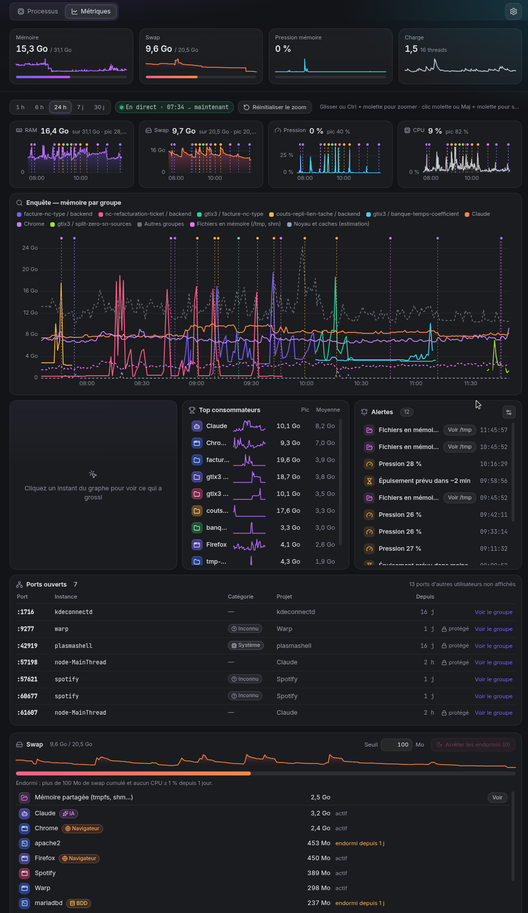

# Computer Watcher

Voir ce qui tourne sur ta machine Linux, depuis combien de temps, ce que ça consomme — et le tuer en un clic.

> [!IMPORTANT]
> **Installe Computer Watcher avec l'AppImage** pour recevoir les mises à jour automatiques : télécharge `computer-watcher-<version>-x86_64.AppImage` dans les [Releases](https://github.com/Floriantoine/computer-watcher/releases), rends-la exécutable (`chmod +x`), lance-la et choisis **Installer comme une app**. Le paquet `.deb` ne se met pas à jour tout seul : il signale seulement les nouvelles versions. Détails dans [Installation](#installation).

Né d'un PC gelé dix minutes par 19 Go de swap : vieilles sessions de terminal, serveurs de dev oubliés dans des worktrees supprimés, navigateur gourmand. Computer Watcher regroupe tout ça pour qu'on le voie et qu'on le nettoie avant d'en arriver là.


## Ce que ça fait

- **Groupes lisibles** : une carte par appli (Chrome, Spotify…), par projet de dev (tous les `node`, `vite`, `esbuild`… d'un même dépôt), une carte « Claude » qui rassemble toutes les sessions Claude Code (chaque session est une racine de l'arbre de détail) ; les outils lancés depuis `~/.claude` (ou `$CLAUDE_CONFIG_DIR`) rejoignent aussi le groupe Claude, même détachés de leur session, et le reste par nom de commande. Les petits groupes sont rangés dans « Autres », sauf les projets, toujours visibles.
- **Classement des instances** : chaque serveur de dev est reconnu (Front, Back, BDD, Worker, Tests, Outils…), avec son port en écoute et un badge « en double » s'il tourne deux fois. Filtres par catégorie, « Tuer la sélection », « Tuer le front », « Tout arrêter »… (voir plus bas).
- **Ancienneté** de chaque groupe et de chaque processus, en orange au-delà d'un jour.
- **Bandeau système** : RAM, swap, pression mémoire (PSI), charge.
- **Page de détail** : arbre parent → enfants, commande complète, dossier de travail, CPU, RAM, swap.
- **Kill** : `SIGTERM`, puis bouton « Forcer (SIGKILL) » si le processus résiste 3 secondes.
- **Programmes protégés** : terminaux, shells, Claude, bureau… Les tuer demande une confirmation qui dit exactement ce qui va mourir. La liste se modifie dans les Réglages et est conservée dans `~/.config/computer-watcher/config.json`.
- **Mini-courbes** de mémoire sur chaque carte et **vue liste** compacte en alternative aux cartes.
- **Historique en arrière-plan** et onglet **Métriques** (voir plus bas).
- **Disque** : ce qui remplit le dossier personnel (soleil façon Filelight), caches à libérer en sécurité, alerte quand un disque est presque plein (voir plus bas).
- **Icône dans la barre des tâches** : un anneau montre la RAM utilisée, sa couleur suit la pression mémoire (normal, orange, rouge). Son menu donne la RAM, le swap, la pression et la charge, et propose « Ouvrir Computer Watcher », « Libérer de la mémoire… » et « Quitter ». Fermer la fenêtre la cache dans la barre au lieu de quitter ; la collecte est alors suspendue, comme fenêtre réduite. Les deux se coupent dans Réglages → Affichage. Sur un bureau sans zone de notification (pas de `StatusNotifierWatcher` sur le bus de session), pas d'icône et fermer la fenêtre quitte l'app.
- Computer Watcher refuse de tuer lui-même, ses parents (ton terminal) et les processus des autres utilisateurs.

## Classement front / back et actions groupées

Dans un projet, Computer Watcher découpe les processus en **instances** : un serveur et ses enfants (`npm run dev` → `vite` → `esbuild` donne une instance « vite »), classées dans une **catégorie** :

| Catégorie | Exemples |
|---|---|
| Front | `vite`, `next dev`, `nuxt`, `ng serve`, `webpack serve`, `storybook` |
| Back | `nest start`, `node dist/main`, `tsx src/server.ts`, `uvicorn`, `manage.py runserver`, `rails s`, `go run`, `cargo run` |
| BDD | `postgres`, `mysqld`, `redis-server`, `mongod`, `meilisearch` |
| Worker | `celery`, `rq worker`, `sidekiq`, `bullmq`, scripts `worker`/`queue`/`consumer` |
| Tests | `vitest`, `jest`, `playwright test`, `pytest` |
| Outils | `tsc --watch`, `esbuild --watch`, serveurs de langage (`tsserver`, `gopls`, `pyright`…), `vite build` |
| Conteneur, Navigateur, IA, Système | `docker`, `podman` ; Chrome, Firefox ; Claude, serveurs MCP ; bureau et services (kwin, pipewire, systemd…) |
| Inconnu | tout le reste (les shells et terminaux restent sans étiquette) |

**D'où vient la catégorie**, dans cet ordre (la première qui conclut gagne) : ta correction manuelle, puis la ligne de commande, puis le port en écoute (5173 → front, 5432 → BDD, 8000 → back…), puis un script `dev` / `start*` du `package.json` du projet qui lance cette commande. Les dépendances seules (`react`, `express`…) ne classent rien.

- **Reclasser** : dans le détail d'un projet, section « Instances », le menu « Reclasser » corrige une erreur en un clic. Un `node server.js` resté « Inconnu » devient ainsi un « Back ». La correction est retenue pour ce projet et ce motif de commande (elle survit aux redémarrages du serveur) ; « Revenir à l'automatique » l'annule. Toutes les corrections se retrouvent dans Réglages → Classement, où l'on peut les retirer une par une ou tout effacer.
- **Ports** : les ports TCP en écoute sont lus toutes les 10 s dans `/proc/net/tcp{,6}`, pour les projets et les bases seulement, et affichés sur les étiquettes (`Front :5173`). Les ports des processus d'autres utilisateurs (un `postgres` lancé par le système, par exemple) ne sont pas lisibles. Réglages → Classement → « Détecter les ports » coupe cette lecture.
- **Qui tient le port ?** : taper `:3000` (ou `port:3000`) dans la recherche affiche, au-dessus des cartes, les processus qui écoutent ce port (catégorie, projet, commande, ancienneté) et ne garde que leurs cartes. Le bouton **« Libérer :3000 »** n'existe que pour une instance non protégée d'un projet (même périmètre que le kill groupé) : il tue l'instance par le chemin habituel. Les autres lignes (applis, Claude et ses serveurs MCP, commandes, système) ne montrent que l'information et « Voir le groupe ». Dans le détail d'un projet, une instance non protégée qui écoute affiche le même bouton. L'onglet Métriques liste tous les **ports ouverts** de tes processus, triés par port, avec le même bouton. Les ports des autres utilisateurs (un `postgres` ou `cups` système) sont signalés (« écouté par un autre utilisateur (uid 965) », « n ports d'autres utilisateurs non affichés ») mais jamais arrêtables, de même que tes ports sans processus lisible (conteneur, autre espace de noms : « n ports sans processus lisible »). Pendant une recherche `:port` sur la page Processus ou onglet Métriques ouvert, les ports de **tous** tes processus sont lus toutes les 10 s, par tranches de quelques millisecondes ; sinon seulement ceux des projets et des bases.
- **Doublons** : deux instances du même projet, de la même catégorie (front, back, worker ou BDD) et de la même commande sont des doublons. Toutes sauf la plus ancienne portent le badge « en double ». Une API et un worker, ou deux applis d'un monorepo, n'en sont pas.
- **Filtres** : sous la barre d'outils, une pastille par catégorie présente (avec le nombre d'instances), à sélection multiple et mémorisée. Un groupe reste affiché s'il a au moins une instance d'une catégorie choisie.
- **Kill groupé** : avec un filtre actif, « Tuer la sélection (n) » ; dans le détail d'un projet, « Tuer le front », « Tuer le back » et « Tout arrêter ». Tous ouvrent la même confirmation, qui liste exactement les instances visées (projet, catégorie, commande, ports, ancienneté, RAM, CPU instantané) avec des raccourcis « Toutes », « Inactives > 1 h », « Inactives > 1 j » et « Doublons seulement ». Garde-fous :
  - seuls les processus des **projets** (et des dossiers supprimés) sont visés : les applis, Claude et les services gardent leurs étiquettes mais ne sont jamais tués en groupe ;
  - les instances **protégées** (🔒) sont décochées par défaut et se cochent une par une ;
  - le kill passe par le même chemin que le kill simple (`SIGTERM`, puis « Forcer » ; refus pour Computer Watcher lui-même, ses parents et les autres utilisateurs), au plus 2 000 processus par demande.
- **Lanceurs** : `npm`, `pnpm`, `yarn`, `npx`, `concurrently`, `nodemon`, `turbo`… qui ne font que lancer un serveur ne forment pas d'instance : ils s'arrêtent d'eux-mêmes quand leurs enfants meurent. « Tout arrêter » les ajoute au kill du projet seulement si toutes les instances qu'ils lancent sont cochées. Les `sh -c` intermédiaires ne sont jamais visés : ils se terminent avec leur commande.
- **Inactives** : une instance est « inactive depuis 1 h » si elle tourne depuis au moins 1 h et que l'historique n'a aucun échantillon à 1 % de CPU ou plus pour ses processus sur cette période. Ces raccourcis ont donc besoin du service d'enregistrement (voir plus bas) ; s'il est arrêté, ils sont désactivés. Au-delà de 30 minutes, seules les moyennes par minute sont lues : un pic de moins d'une minute peut passer inaperçu.

## Installation

Les fichiers sont publiés dans les [Releases](https://github.com/Floriantoine/computer-watcher/releases), avec un fichier `latest-linux.yml` qui donne l'empreinte SHA-512 de l'AppImage.

### Debian / Ubuntu (.deb)

```bash
sudo apt install ./computer-watcher-<version>-amd64.deb
```

Le paquet ajoute l'entrée de menu et l'icône. Il remplace l'ancien paquet `proc-watch` s'il est installé (au lieu de s'installer à côté). Désinstaller le paquet : `sudo apt remove computer-watcher`.

### Toutes distributions (AppImage)

1. Télécharger `computer-watcher-<version>-x86_64.AppImage`.
2. `chmod +x computer-watcher-*.AppImage` puis le lancer.
3. Au premier lancement, l'assistant d'accueil propose **Installer comme une app** : copie dans `~/Applications/computer-watcher.AppImage`, entrée de menu et icône, puis relance depuis la copie. Il peut aussi supprimer le fichier téléchargé, seulement si la case est cochée (une confirmation montre le chemin exact) : la copie relancée le supprime après avoir démarré, s'il n'a pas changé (même SHA-256). Une entrée de menu ou de démarrage `computer-watcher.desktop` déjà présente et qui n'a pas été écrite par Computer Watcher n'est jamais écrasée. Les mises à jour automatiques remplacent ensuite cette copie.

Sur Ubuntu 22.04+, les AppImage demandent `libfuse2` : `sudo apt install libfuse2`.

### Arch / Manjaro (AUR)

Un paquet `computer-watcher-bin` est prévu ; en attendant, utiliser l'AppImage.

### Vérifier l'empreinte SHA-512

`latest-linux.yml` donne le `sha512` de l'AppImage, encodé en base64 (c'est aussi ce que vérifient les mises à jour automatiques). Pour comparer :

```bash
sha512sum computer-watcher-<version>-x86_64.AppImage | cut -d' ' -f1 | xxd -r -p | base64 -w0; echo
grep -A2 'computer-watcher-<version>-x86_64.AppImage' latest-linux.yml
```

Les deux valeurs doivent être identiques. Le `.deb` n'y figure pas : comparer `sha256sum computer-watcher-<version>-amd64.deb` à l'empreinte affichée par GitHub à côté du fichier.

### Premier lancement

Un assistant de 3 ou 4 écrans (« Passer » à tout moment, Échap ; Alt+← / Alt+→ pour naviguer) :

1. **Installer comme une app** (AppImage seulement) : voir plus haut.
2. **Démarrer avec la session** (coché par défaut) : `~/.config/autostart/computer-watcher.desktop` lance Computer Watcher avec `--hidden`, caché dans la barre des tâches (fenêtre réduite si le bureau n'a pas de zone de notification). Réglable ensuite dans Réglages › Affichage.
3. **Historique** : le service d'enregistrement (voir [Historique en arrière-plan](#historique-en-arrière-plan)) : ce qui est noté, où, combien de place.
4. **Protection contre les gels** : état d'earlyoom et « Installer et configurer ».

Chaque étape affiche le résultat exact (chemins écrits) ou l'erreur. L'assistant ne revient plus ensuite ; il se rouvre depuis Réglages › À propos › **Relancer l'accueil**.

### Désinstaller

Réglages › À propos › **Désinstaller Computer Watcher…** : deux cases (supprimer aussi l'historique, la configuration — réglages, et profil de la fenêtre de l'app dans le même dossier) et la liste exacte de ce qui sera retiré, reprise dans une confirmation native. Sont retirés : le démarrage automatique, l'entrée de menu et l'icône (seulement celles écrites par Computer Watcher, marquées `X-ProcWatch-Managed=1`), le service d'enregistrement (arrêté, désactivé, unité supprimée), puis `~/Applications/computer-watcher.AppImage` en dernier, et Computer Watcher quitte. Seuls les fichiers que Computer Watcher crée sont touchés (liste exacte, liens symboliques jamais suivis) ; earlyoom n'est jamais modifié. Si un élément ne peut pas être retiré (par exemple `systemctl --user` injoignable : le service et son unité restent), il est signalé et la copie de l'AppImage reste, pour réessayer. Avec le `.deb`, retirer ensuite le paquet avec `sudo apt remove computer-watcher`. Les restes à l'ancien nom (`proc-watch`, voir [Venir de proc-watch](#venir-de-proc-watch)) sont retirés aussi, sous les mêmes contrôles.

### Mises à jour

- **AppImage** (copie installée `~/Applications/computer-watcher.AppImage`, ou AppImage lancée directement s'il n'y a pas de copie) : Computer Watcher vérifie les versions publiées 30 s après le lancement puis toutes les 6 h. Une nouvelle version s'annonce dans un pop-up (« Mettre à jour », « Plus tard », « Ignorer cette version ») ; rien n'est téléchargé sans accord. Le fichier est vérifié (sha512) puis installé au redémarrage : l'AppImage est remplacée dans son dossier, le service d'enregistrement et le raccourci du menu suivent le nouveau fichier.
- AppImage lancée hors de la copie installée : le pop-up invite à lancer Computer Watcher depuis le menu (l'original téléchargé n'est pas mis à jour).
- Fichier remplacé : electron-updater remplace le fichier désigné par `APPIMAGE`, que le runtime AppImage pose sur l'AppImage réellement lancée, donc la copie `~/Applications/computer-watcher.AppImage` quand Computer Watcher tourne depuis elle. Son nom n'ayant pas de numéro de version, elle est écrasée sur place (même chemin pour le menu, le démarrage automatique et le service). Computer Watcher refuse l'installation si `APPIMAGE` n'est pas l'AppImage qu'il a vérifiée (montage FUSE, en-tête AppImage).
- Service d'enregistrement : dès que la copie installée existe, son unité pointe vers elle, jamais vers l'original téléchargé (qui peut être supprimé), y compris quand l'original est relancé.
- **.deb** : le pop-up signale la nouvelle version et ouvre sa page ; la mise à jour se fait avec `apt`.
- **Depuis les sources** : aucune vérification.

Réglages › À propos : version, vérification automatique (activée par défaut), préversions (désactivées), « Vérifier maintenant ».

### Venir de proc-watch

L'app s'appelait proc-watch jusqu'à la v0.1.3. Au premier lancement de la nouvelle version (mise à jour automatique comprise), une migration unique reprend l'installation existante, sans rien perdre :

1. l'ancien service `proc-watch-recorder` est arrêté, vérifié arrêté, puis désactivé (s'il appartient à autre chose, ou si `systemctl --user` échoue, rien ne bouge et le service est remis dans son état initial) ;
2. les dossiers sont renommés en place : `~/.config/proc-watch` → `~/.config/computer-watcher` (réglages, profil de la fenêtre), `~/.local/share/proc-watch` → `~/.local/share/computer-watcher` (historique), ainsi que le cache des mises à jour (le dossier d'exécution `$XDG_RUNTIME_DIR/proc-watch`, éphémère, n'est jamais déplacé). Un lien symbolique ou un point de montage est refusé, de même qu'un dossier qu'un processus utilise encore (dossier courant, fichier ouvert ou projeté en mémoire : le message donne son pid et son nom) ; si le nouveau dossier existe déjà et n'est pas vide, rien n'est fusionné ni supprimé : l'ancien reste en place et c'est signalé ;
3. le service `computer-watcher-recorder` remplace l'ancien (unité retirée seulement si c'est la nôtre) ;
4. les entrées `proc-watch.desktop` (menu, démarrage automatique) deviennent `computer-watcher.desktop`, seulement si elles ont été écrites par l'app (`X-ProcWatch-Managed=1`) ; une entrée sans cette marque n'est jamais modifiée ni supprimée ;
5. une copie `~/Applications/proc-watch.AppImage` devient `~/Applications/computer-watcher.AppImage` (copie vérifiée), l'app se relance depuis elle, et la nouvelle instance supprime l'ancienne copie si elle n'a pas changé.

Tant qu'une ancienne version est encore ouverte, la migration attend (message au lancement, avec le pid et le nom du processus). Si `XDG_CONFIG_HOME`, `XDG_DATA_HOME` et `XDG_CACHE_HOME` ne sont pas toutes par défaut ou toutes définies (« XDG partiel », typiquement une app d'essai), rien n'est migré ni désinstallé hors de la racine de la configuration : c'est dit dans Réglages › À propos et dans le journal. Au premier lancement, la fenêtre peut tarder jusqu'à une trentaine de secondes au pire (`systemctl --user` bloqué, ou relance qui attend que l'instance précédente ait quitté). Si une étape échoue, les suivantes qui en dépendent n'ont pas lieu, rien n'est supprimé et l'app continue avec les anciens dossiers ; un message l'explique au démarrage, et Réglages › À propos montre l'état de la migration avec **Réessayer**. Les quarantaines `/tmp/.proc-watch-trash-*` restent reconnues et vidables.

### Depuis les sources

```bash
git clone https://github.com/Floriantoine/computer-watcher
cd computer-watcher
npm install
npm run dev
```

Avec npm 11.10+ (dont npm 12), les scripts d'installation des dépendances sont bloqués par défaut. Le champ `allowScripts` de `package.json` n'autorise en pratique que celui d'`esbuild`, une simple optimisation de démarrage qui n'est pas requise. Le paquet `electron` 44 n'a pas de script d'installation : son binaire est téléchargé au premier `require('electron')`. Un simple `npm install` suffit.

## Développement

| Commande | Rôle |
|---|---|
| `npm run dev` | lance l'app avec rechargement à chaud |
| `npm test` | tests unitaires (Vitest) |
| `npm run typecheck` | vérification TypeScript |
| `npm run test:recorder` | build, test de performance du service d'enregistrement et test de bout en bout (base, événements, reprise) |
| `npm run smoke` | build + lancement réel de l'app via Playwright |
| `npm run dist` | produit l'AppImage et le .deb dans `release/` |
| `npm run test:disk-page` | build + page Disque de bout en bout sur un HOME factice (faux caches, pkexec simulé, confirmation remplacée) |
| `npm run test:update` | build + mises à jour de bout en bout contre un flux local (rien n'est installé) ; le flux de test n'est accepté que depuis les sources, avec l'option `--update-feed-test`, une adresse en boucle locale et un jeton aléatoire en tête du chemin (`http://127.0.0.1:<port>/<jeton ≥ 32 caractères>/`) ; jamais dans une version empaquetée |
| `npm run release -- patch\|minor\|major [--dry-run]` | prépare une version : vérifications, tests, commit `chore(release): vX.Y.Z` et étiquette annotée, sans pousser |

Publier : `npm run release -- patch`, relire, puis `git push --atomic origin main vX.Y.Z`. Le workflow `release` a deux jobs. `build`, en lecture seule, vérifie que le commit étiqueté est sur `main` et que l'étiquette correspond à `package.json`, relance les types et les tests, puis construit l'AppImage, le .deb et `latest-linux.yml` (lu par les mises à jour). `publish`, seul à pouvoir écrire, n'exécute aucun code npm : il crée la version GitHub avec ces fichiers.

Notes de version : le corps du message de l'étiquette annotée (tout sauf la première ligne) devient les notes de la version GitHub et de `latest-linux.yml`, affichées dans le pop-up de mise à jour. `npm run release` l'écrit : un texte rédigé pour la première version, puis les sujets des commits `feat` / `fix` depuis la version précédente, sans les commits internes ni les références de revue. Pour le modifier avant de pousser : `git tag -f -a vX.Y.Z -F notes.txt` (première ligne `Computer Watcher vX.Y.Z`, ligne vide, puis les notes).

La logique (lecture de `/proc`, regroupement, protection, kill) vit dans `src/core/`, sans dépendance à Electron, et se teste sur de faux répertoires `/proc`. Pour reconnaître une nouvelle appli multi-processus, modifier `src/core/grouping/rules.ts` ; pour classer un nouvel outil de dev (front, back…), `src/core/classify/rules.ts`.

## Historique en arrière-plan

Au premier lancement de la version installée (AppImage, .deb), Computer Watcher installe automatiquement un service systemd utilisateur, `computer-watcher-recorder` (sans sudo). Depuis un clone du dépôt (`npm run dev`), rien n'est installé en silence : activer le réglage Réglages → Enregistrement, ou lancer avec `PROC_WATCH_RECORDER_DEV=1`. Il échantillonne le système en continu, même quand la fenêtre est fermée, pour répondre à « qu'est-ce qui a fait geler la machine à 3 h du matin ? ».

- **Couper l'enregistrement** : Réglages → Enregistrement (arrête et supprime le service). `systemctl --user disable --now computer-watcher-recorder` seul ne tient pas : tant que le réglage reste activé, l'app réactive le service à son prochain lancement.
- **Ce qui est enregistré** : un échantillon toutes les 5 s. Un groupe est enregistré à part s'il dépasse 20 Mo (RAM+swap) ou 1 % de CPU ; les autres (souvent ~300 petites commandes) sont cumulés dans un seul groupe « Petits groupes ». Un processus seul n'est enregistré que s'il dépasse 50 Mo ou 1 % de CPU. Intervalle, seuils et rétention se règlent dans Réglages → Enregistrement.
- **Données** : `~/.local/share/computer-watcher/metrics.db` (SQLite, schéma v6). Rétention par défaut : 24 h détaillées (5 s), 30 jours résumés (par minute et par heure ; les plages de 7 et 30 jours lisent les heures). À la mise à jour du schéma, une copie `metrics.db.pre-v6-*` (selon la version) est faite avant migration si la place le permet (sinon la migration a lieu quand même, avec un avertissement dans Réglages) ; les copies plus vieilles que la rétention résumée sont supprimées. Une base d'une version plus récente n'est jamais écrasée : l'enregistrement se met en pause.
- **Taille mesurée** (test à la cardinalité réelle, `npm run test:recorder`) : ~130 Mo pour les 24 h détaillées, ~3 Mo/jour de résumés pour les groupes et le système, et ~6 à 28 Mo/jour pour les processus selon le nombre de processus courts de plus de 50 Mo (lignes de commande comprises). Soit, à 30 jours, environ 0,4 Go sur une machine calme et jusqu'à ~1,1 Go lors de journées de développement intensives (~1 300 processus distincts > 50 Mo par heure). Monter le seuil mémoire des processus réduit surtout cette dernière part.
- **Lecture** : chaque requête de l'onglet Métriques prend moins de 50 ms à 30 jours d'historique ; les plages de 7 et 30 jours ne se rafraîchissent qu'à la demande (bouton « Actualiser »).
- **Coût mesuré** : sur ~750 processus, un tick du service dure environ 21 à 28 ms et le service occupe environ 34 à 48 Mo de PSS.
- **Vider l'historique** (Réglages → Enregistrement) : supprime aussi les copies de sécurité. Si le service tourne, il vide la base à sa minute suivante ; sinon l'app supprime directement la base, recréée au prochain démarrage du service.
- **Vie privée** : tout reste en local. La base contient les lignes de commande complètes des processus enregistrés (elles peuvent contenir des chemins ou des arguments sensibles) ; fichiers en 0600, dossier en 0700.
- **Désinstaller** : désactiver Réglages → Enregistrement (arrête et supprime le service), ou à la main :
  ```sh
  systemctl --user disable --now computer-watcher-recorder
  rm ~/.config/systemd/user/computer-watcher-recorder.service
  rm -rf ~/.local/share/computer-watcher
  ```
- **Kills earlyoom** : pour les enregistrer, l'utilisateur doit pouvoir lire le journal système (groupe `systemd-journal` ou `adm` sur la plupart des distributions, `wheel` sur certaines). Sans cet accès, Réglages → Enregistrement affiche « Kills earlyoom : indisponibles » et le reste fonctionne normalement.

### Onglet Métriques



- **Enquête — mémoire par groupe** : courbe de la mémoire par groupe sur la période choisie ; cliquer place un curseur sur un instant. Le panneau « À <heure> » liste alors les groupes dont la mémoire a le plus augmenté dans les 5 minutes précédentes.
- **Top consommateurs** : les groupes les plus gourmands en mémoire (moyenne) sur la plage, avec mini-courbe, pic et moyenne.
- **Alertes** : fuites, kills earlyoom, pics de pression et trous d'enregistrement ; un clic place le curseur de l'enquête sur l'événement. Une fuite probable est signalée quand la mémoire d'un groupe monte de façon quasi continue (≥ 80 % des minutes sur 1 h, +300 Mo par défaut, réglable), et un badge « fuite ? » apparaît alors sur sa carte.
- **Swap** : jauge du swap, groupes et instances triés par swap cumulé, avec leur état **actif**, **endormi depuis X** ou **inconnu** (avec la raison), et la ligne « Mémoire partagée (tmpfs, shm…) » (Shmem : RAM + swap non attribuée aux processus ; « Voir » liste les plus gros dossiers de /tmp, en lecture seule, avec un lien vers la page /tmp). **Endormi** : swap cumulé de l'instance ou du groupe au-delà du seuil (100 Mo par défaut, réglable dans l'en-tête du panneau, enregistré à l'Entrée) **et** aucun CPU ≥ 1 % (ou le seuil CPU d'enregistrement s'il est plus haut) depuis 1 jour d'après l'historique. L'historique est lu sur 7 jours au plus (« endormi depuis plus de 7 j »). État « inconnu », et rien de proposé, si le service d'enregistrement est arrêté (aucun échantillon depuis 30 s, ou 3 intervalles s'ils sont plus longs) ou si l'historique est plus court qu'un jour. Un trou d'enregistrement de plus de 10 min (service arrêté, machine en veille) rend la vue « inconnu » pendant les 24 h qui suivent : on ne peut pas affirmer qu'un processus n'a rien fait pendant le trou. « Arrêter les endormis (n) » ouvre le kill groupé habituel, limité aux instances non protégées des projets et dossiers supprimés (jamais celles lancées par une session Claude encore ouverte) ; l'état est revérifié au clic. Une appli endormie (navigateur, lecteur de musique…) a un bouton « Arrêter » individuel, avec confirmation ; jamais Claude, un programme protégé, un groupe de commandes ni un service de session (portail, pipewire, kwallet, kded, KWin, D-Bus, systemd…). Le panneau se relit toutes les 30 s tant que l'onglet est ouvert.

**Gestes sur les graphes** (Métriques et détail d'un groupe) :

| Geste | Effet |
|---|---|
| Glisser sur le graphe, ou Ctrl + molette | zoomer sur une période |
| Maj + molette, ou glisser avec le clic molette | se déplacer dans le temps |
| Double-clic | revenir à la plage complète |
| Zoom collé au bout du graphe | suivi « En direct » : la fenêtre avance avec le temps |
| Survol d'une ligne du Top, de la légende ou d'une alerte | met en avant la courbe ou l'instant correspondant |

### Nettoyer /tmp

L'onglet **/tmp** (en haut, après Métriques) ouvre la page /tmp ; « Voir /tmp » sur une alerte « Fichiers en mémoire » (Métriques › Alertes, pop-up, notification du bureau) et le lien de l'explorateur du swap y mènent aussi. En haut, trois tuiles : **Occupé** (utilisé / taille de /tmp, lus par statfs), **Part de la RAM** (occupé / RAM totale ; « — » si /tmp est sur disque) et **Quarantaine** (quarantaines restées, avec « Vider la quarantaine ») ; si /tmp est illisible, elles affichent l'erreur. Tout est relu à l'ouverture et avec « Actualiser ». Dessous, les éléments de premier niveau de /tmp (en RAM), triés par taille décroissante ou par nom, à cocher, puis « Supprimer la sélection (n · taille) ». La sélection est résumée sous la liste (éléments, total) et la confirmation, une boîte native du main, récapitule chaque élément ; la suppression est définitive (la corbeille est sur disque et ne libérerait pas la RAM). Les caches connus (jest, vite, tsx, node-compile-cache…) portent « cache, se reconstruit tout seul ».

Un élément n'est supprimable que s'il appartient à l'utilisateur, n'est ni un point de montage ni au-dessus d'un, ni un socket, une FIFO ou un périphérique, n'est pas dans la liste système (`.X11-unix`, `ssh-*`, `systemd-private-*`, `tmux-*`, `claude-*`…) et n'est utilisé par aucun processus de l'utilisateur (fichier ouvert, dossier courant, exécutable, bibliothèque projetée, socket Unix actif) ; sinon la ligne dit pourquoi (« utilisé par jest (pid 1234) », « autre utilisateur », « système », « impossible de vérifier »). Les processus à droits élevés (kwin, warp, polkit…) ne sont pas lisibles : un élément qui porte leur nom est refusé, la confirmation les cite, et un élément modifié il y a moins de 5 min est signalé. Les sockets des applications isolées (flatpak, bac à sable de Chromium) ne sont pas vus.

Le main n'accepte que les éléments supprimables de sa dernière liste (nom, inode, périphérique), demande confirmation dans une boîte native (chemins exacts, taille totale, « Annuler » par défaut), puis, pour chaque élément : revérification complète, déplacement dans une quarantaine `.computer-watcher-trash-*` de la racine (les `.proc-watch-trash-*` d'avant le renommage restent reconnues et vidables), ouverte aussitôt et ensuite désignée par son descripteur (jamais par son chemin), contrôle que c'est bien le même inode, et suppression par GNU rm (`rm -r --one-file-system`, sans shell, avec délai) qui ne suit jamais un lien, même substitué pendant la suppression, et ne franchit aucun point de montage ; l'élément n'est annoncé supprimé que si son inode a vraiment disparu. Sans GNU rm, la suppression est désactivée. 50 éléments au plus par demande, jamais en root. Le résultat s'affiche en toast et un événement `tmp_clean` est ajouté au journal (y compris en cas d'échec partiel ; le reste est alors dans la quarantaine). Une quarantaine restée (suppression interrompue) est signalée sous la liste, quelle que soit sa taille, et comptée dans la tuile Quarantaine, avec « Vider la quarantaine » (même confirmation native, même suppression).

Pour les vérifications de l'app, `PROC_WATCH_TMP_ROOT` remplace /tmp seulement si son chemin réel est sous `~/.cache/pw-…` et contient un fichier `.computer-watcher-test-root` ; sinon il est ignoré (message sur la sortie d'erreur). La racine de test est affichée en tête de liste. `npm run test:tmp-page` vérifie la page /tmp de bout en bout sur une telle racine factice (sans rien supprimer).

### Disque

L'onglet **Disque** (après /tmp) montre ce qui remplit le disque et ce qui peut partir sans risque ; « Voir le disque » sur une alerte « Disque presque plein » (pop-up, notification du bureau) y mène aussi.

- **Bandes** : une par disque réel (lu dans `/proc/self/mountinfo` : ext4, btrfs, xfs, f2fs, vfat de plus de 1 Go… ; jamais tmpfs, overlay, squashfs, AppImage, `/boot`, `/efi` ni les supports amovibles ; les sous-volumes btrfs d'un même disque n'en font qu'une), avec l'utilisé, le libre et la place récupérable des familles qui s'y trouvent.
- **Soleil** du dossier personnel : anneaux = niveaux de dossiers (3 visibles), angle proportionnel à la taille, une teinte par dossier de premier niveau, petits dossiers (< 0,5 %) regroupés en « autres ». Survol : nom, chemin, taille, part du parent ; clic : entrer ; centre ou fil d'Ariane : remonter. Les segments d'une famille récupérable sont entourés de blanc ; un clic dessus coche la famille. Clic droit sur un autre dossier : « Ouvrir dans le gestionnaire de fichiers » (dossier réel sous le dossier personnel seulement). Le parcours tourne dans un processus enfant à basse priorité (nice 19, ionice idle), sans jamais suivre de lien ni traverser de point de montage, avec un budget de temps et d'entrées ; le résultat est gardé 10 min (« Actualiser » pour reparcourir).
- **Familles** (liste fermée) : caches npm (`~/.npm/_cacache`), pnpm, Yarn, uv, pip, Cargo (registre et checkouts git), paru, yay, anciennes versions des navigateurs de test (Playwright, Puppeteer : la plus grande version et la plus récemment modifiée de chaque navigateur sont gardées ; un numéro aberrant, à zéros en tête ou de plus de 9 chiffres, n'est jamais pris pour une version), contenu de la corbeille, et en administrateur le cache de paquets (`paccache -rk2`, paquet pacman-contrib, ou `apt-get clean`) et les journaux systemd (`journalctl --vacuum-size=500M`). Chaque ligne donne la taille mesurée, « libère ≈ », l'heure de la mesure et, s'il y a lieu, la raison d'un refus. Les tailles sont mesurées par le service une fois par jour (`du` à basse priorité, une seule partition, liens jamais suivis), ou par l'app si la mesure a plus de 24 h ; elles sont dans `disk-families.json` du dossier de données.
- **Garde-fous** : le renderer n'envoie que des noms de familles ; le main recalcule les chemins depuis HOME et XDG. Il refuse une famille dont la racine XDG, en chemin réel (liens résolus), est le dossier personnel lui-même ou est hors de lui, ou qui, réglée ailleurs que le défaut, ne ressemble pas à un dossier de caches (`CACHEDIR.TAG` ou deux outils connus) ou de données (deux dossiers parmi applications, icons, Trash, pnpm, mime, fonts) : « racine XDG inhabituelle », ou dont le dossier ne porte pas la signature de l'outil (`_cacache/index-v5` pour npm, `CACHEDIR.TAG`, `.lock` ou `*-v<n>` pour uv, `http-v2`/`wheels` pour pip, `v<n>` avec des `npm-*` pour Yarn, `v<n>` avec `files` ou `index` pour pnpm, `index`/`cache` du registre Cargo, `clone` ou des `PKGBUILD` pour paru et yay, `<navigateur>-<numéro>` pour les navigateurs de test : « ne ressemble pas à un cache de … ») ; puis une famille dont un dossier est un lien symbolique, est sur un autre disque que le dossier personnel, contient un point de montage, ou est utilisé (dossier courant, fichier ouvert ou bibliothèque projetée d'un processus de l'utilisateur ; outil de la famille en cours, comme `npm` ou `uv`) : « utilisé par uv (pid 1234) ». Une seule confirmation native récapitule chaque famille et liste les chemins réels qui seront supprimés, chacun avec sa taille (mesure plafonnée à 30 s, « Mesure des tailles… » sur le bouton pendant ce temps) ; tout est revérifié juste avant de supprimer ; la suppression passe par des descripteurs de dossier (jamais de lien suivi, jamais de montage traversé). C'est définitif : la corbeille ne libérerait rien. Le toast donne la place libérée (statfs avant / après, ou l'estimation si le système de fichiers ne la montre pas encore) et un événement `disk_clean` est ajouté au journal.
- **Administrateur** : un seul `pkexec /usr/bin/bash -c SCRIPT computer-watcher-disk <pkg-cache|journal>` par famille, script figé (chemins absolus, environnement vidé, `/etc/os-release` lu sans être exécuté), aucun autre argument. Annuler la fenêtre de mot de passe n'est pas une erreur ; sans paccache, la ligne dit « installer pacman-contrib ».
- **Alerte « Disque presque plein »** : quand le libre d'un disque surveillé passe sous 10 % de sa taille ou sous 20 Go (le premier atteint ; Réglages → Enregistrement), tenu 60 s ; une seule alerte jusqu'à ce que le libre remonte au-dessus du seuil + 5 %. Le service enregistre l'espace libre à chaque échantillon : petit graphe « Espace libre » dans Métriques.

`npm run test:disk-page` vérifie la page de bout en bout sur un dossier personnel factice sous `~/.cache/pw-disk-page-*` ; `PROC_WATCH_DISK_ROOT_FAKE=1` (ignoré par une app empaquetée) remplace pkexec par un succès simulé.

### Pop-ups et notifications d'alerte

- **Pop-ups** : chaque nouvelle alerte (kill earlyoom, fuite, fichiers en mémoire, pression) s'affiche en haut à droite de Computer Watcher et y reste jusqu'à « Fermer ». Au-delà de 3, un « + n autres » les regroupe (avec « Tout fermer »). L'onglet Métriques porte le nombre d'alertes non vues. Au premier lancement, les alertes déjà enregistrées ne s'affichent pas.
- **Notifications du bureau** : envoyées par le service d'enregistrement, donc même quand Computer Watcher est fermé, avec `notify-send` (paquet libnotify ; absent : pas de notification, sans erreur). Elles sont « critiques » (KDE les garde jusqu'au clic) et ont un bouton « Ouvrir » si `notify-send` connaît `--action` (libnotify ≥ 0.7.9). Pas de notification quand la fenêtre de Computer Watcher a le focus : le pop-up suffit. (la fenêtre signale son focus au service par un petit fichier, `$XDG_RUNTIME_DIR/computer-watcher/focus-<empreinte>.json`, propre à chaque dossier de données ; périmé au bout de 10 s si l'app est fermée).
- **Réglages → Alertes** : pour chaque type, « Pop-up et bureau », « Pop-up seulement » ou « Rien » (par défaut : pression en pop-up seulement, le reste partout) ; au plus une notification du bureau par type toutes les 5 min (1 à 120).
- **« Ouvrir »** lance Computer Watcher, ou affiche la fenêtre déjà ouverte (instance unique), sur l'instant de l'alerte (`--alert=<id>`). Le service trouve l'app à partir de son propre emplacement : AppImage → le fichier AppImage ; paquet → le binaire installé ; clone du dépôt lancé avec `npm start` (`electron-vite preview`) → `electron <dossier du clone>` (la sortie `out/` doit être construite). L'app est lancée sous le même utilisateur, via `systemd-run --user` quand il existe (hors du service : redémarrer le service ne la ferme pas). Sinon, la notification part sans bouton.

### Règles automatiques

Réglages → Règles : le service d'enregistrement peut arrêter des processus **sans confirmation** selon des règles. Tout est éteint par défaut (interrupteur « Règles automatiques » : éteint, rien ne tourne, pas même les simulations).

- **Conditions** : un groupe ou une instance (par nom, comparé tel quel, ou par catégorie) au-dessus de X Go (RAM + swap) pendant Y min ; une instance de projet (front, back…) inactive depuis T (aucune mesure CPU ≥ 1 % ; sans historique couvrant toute la période, rien n'est arrêté) ; la prévision « Mémoire bientôt épuisée » qui annonce l'épuisement dans moins de N min (cible : le plus gros groupe qui grossit ; les applis seulement si tu les coches).
- **Simulation d'abord** : chaque nouvelle règle démarre en Simulation (journal « aurait arrêté… », aucun signal). Le passage en « Active » demande une confirmation ; une règle active dont la condition change repasse en Simulation. Trois modèles fournis, désactivés.
- **Action** : SIGTERM, puis SIGKILL 5 s plus tard aux seuls processus encore vivants avec la même identité (pid + heure de démarrage).
- **Garde-fous** (codés en dur, revérifiés juste avant chaque signal) : jamais Claude ni ce qu'il a lancé, les terminaux et les shells, le bureau (KWin, Plasma, X), systemd, D-Bus, PipeWire, earlyoom, Computer Watcher et ses parents, les programmes protégés, root ni les processus d'autres utilisateurs. Au plus 1 action par règle toutes les 5 min et 10 par heure en tout : au-delà, la règle se met en pause 1 h (notification).
- **Journal** : chaque action et chaque simulation est une alerte (Métriques → Alertes, pop-up, notification du bureau pour les actions) ; Réglages → Règles montre le dernier déclenchement et le nombre sur 7 jours. Une règle invalide écrite à la main dans `config.json` est ignorée seule, avec son erreur affichée.

## Va bien avec earlyoom

Computer Watcher ne tue jamais rien tout seul, sauf règles automatiques que tu as activées. Pour éviter qu'un manque de mémoire ne gèle la machine, installe [earlyoom](https://github.com/rfjakob/earlyoom). Si earlyoom manque ou est arrêté, Computer Watcher le signale au lancement et peut l'installer, le configurer et l'activer (Réglages › earlyoom), avec un seul mot de passe administrateur, après une confirmation qui montre le paquet, le gestionnaire et la ligne exacte. Le gestionnaire de paquets (pacman, apt-get, dnf ou zypper ; d'après `/etc/os-release` s'il y en a plusieurs) tourne sans questions et sans paquets recommandés ; apt-get ne supprime jamais rien (`--no-remove`). Attention : en mode non interactif, dnf importe automatiquement la clé GPG d'un dépôt qui la demande, et pacman importe une clé PGP inconnue (la confiance du trousseau reste exigée).

## Licence

MIT
