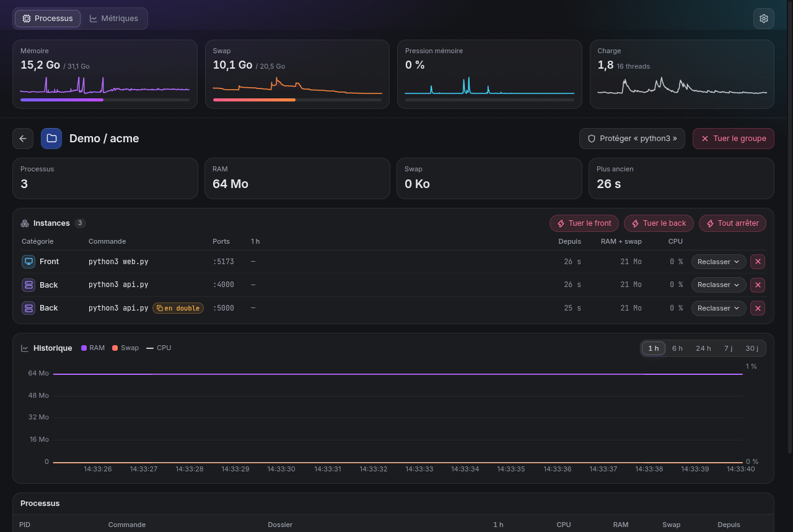

# proc-watch

Voir ce qui tourne sur ta machine Linux, depuis combien de temps, ce que ça consomme — et le tuer en un clic.

Né d'un PC gelé dix minutes par 19 Go de swap : vieilles sessions de terminal, serveurs de dev oubliés dans des worktrees supprimés, navigateur gourmand. proc-watch regroupe tout ça pour qu'on le voie et qu'on le nettoie avant d'en arriver là.



## Ce que ça fait

- **Groupes lisibles** : une carte par appli (Chrome, Spotify…), par projet de dev (tous les `node`, `vite`, `esbuild`… d'un même dépôt), une carte « Claude » qui rassemble toutes les sessions Claude Code (chaque session est une racine de l'arbre de détail), et le reste par nom de commande. Les petits groupes sont rangés dans « Autres ».
- **Ancienneté** de chaque groupe et de chaque processus, en orange au-delà d'un jour.
- **Bandeau système** : RAM, swap, pression mémoire (PSI), charge.
- **Page de détail** : arbre parent → enfants, commande complète, dossier de travail, CPU, RAM, swap.
- **Kill** : `SIGTERM`, puis bouton « Forcer (SIGKILL) » si le processus résiste 3 secondes.
- **Programmes protégés** : terminaux, shells, Claude, bureau… Les tuer demande une confirmation qui dit exactement ce qui va mourir. La liste se modifie dans les Réglages et est conservée dans `~/.config/proc-watch/config.json`.
- **Mini-courbes** de mémoire sur chaque carte et **vue liste** compacte en alternative aux cartes.
- **Historique en arrière-plan** et onglet **Métriques** (voir plus bas).
- proc-watch refuse de tuer lui-même, ses parents (ton terminal) et les processus des autres utilisateurs.

## Installation

### AppImage (toutes distributions)

1. Télécharger `proc-watch-<version>-x86_64.AppImage` depuis les [Releases](https://github.com/Floriantoine/proc-watch/releases).
2. `chmod +x proc-watch-*.AppImage` puis le lancer.
3. Dans **Réglages**, cliquer **Ajouter au menu des applications**.

Sur Ubuntu 22.04+, les AppImage demandent `libfuse2` : `sudo apt install libfuse2`.

### Debian / Ubuntu

```bash
sudo apt install ./proc-watch-<version>-amd64.deb
```

### Depuis les sources

```bash
git clone https://github.com/Floriantoine/proc-watch
cd proc-watch
npm install
npm run dev
```

Avec npm 11.10+ (dont npm 12), les scripts d'installation des dépendances sont bloqués par défaut. Le champ `allowScripts` de `package.json` n'autorise en pratique que celui d'`esbuild`, une simple optimisation de démarrage qui n'est pas requise. Le paquet `electron` 44 n'a pas de script d'installation : son binaire est téléchargé au premier `require('electron')`. Un simple `npm install` suffit.

## Développement

| Commande | Rôle |
|---|---|
| `npm run dev` | lance l'app avec rechargement à chaud |
| `npm test` | tests unitaires (Vitest) |
| `npm run typecheck` | vérification TypeScript |
| `npm run test:recorder` | build, test de performance du service d'enregistrement et test de bout en bout (base, événements, reprise) |
| `npm run smoke` | build + lancement réel de l'app via Playwright |
| `npm run dist` | produit l'AppImage et le .deb dans `release/` |

La logique (lecture de `/proc`, regroupement, protection, kill) vit dans `src/core/`, sans dépendance à Electron, et se teste sur de faux répertoires `/proc`. Pour reconnaître une nouvelle appli multi-processus ou un nouvel outil de dev, modifier `src/core/grouping/rules.ts`.

## Historique en arrière-plan

Au premier lancement de la version installée (AppImage, .deb), proc-watch installe automatiquement un service systemd utilisateur, `proc-watch-recorder` (sans sudo). Depuis un clone du dépôt (`npm run dev`), rien n'est installé en silence : activer le réglage Réglages → Enregistrement, ou lancer avec `PROC_WATCH_RECORDER_DEV=1`. Il échantillonne le système en continu, même quand la fenêtre est fermée, pour répondre à « qu'est-ce qui a fait geler la machine à 3 h du matin ? ».

- **Couper l'enregistrement** : Réglages → Enregistrement (arrête et supprime le service). `systemctl --user disable --now proc-watch-recorder` seul ne tient pas : tant que le réglage reste activé, l'app réactive le service à son prochain lancement.
- **Ce qui est enregistré** : un échantillon toutes les 5 s. Un groupe est enregistré à part s'il dépasse 20 Mo (RAM+swap) ou 1 % de CPU ; les autres (souvent ~300 petites commandes) sont cumulés dans un seul groupe « Petits groupes ». Un processus seul n'est enregistré que s'il dépasse 50 Mo ou 1 % de CPU. Intervalle, seuils et rétention se règlent dans Réglages → Enregistrement.
- **Données** : `~/.local/share/proc-watch/metrics.db` (SQLite, schéma v3). Rétention par défaut : 24 h détaillées (5 s), 30 jours résumés (par minute et par heure ; les plages de 7 et 30 jours lisent les heures). À la mise à jour du schéma, une copie `metrics.db.pre-v3-*` est faite avant migration si la place le permet (sinon la migration a lieu quand même, avec un avertissement dans Réglages) ; les copies plus vieilles que la rétention résumée sont supprimées. Une base d'une version plus récente n'est jamais écrasée : l'enregistrement se met en pause.
- **Taille mesurée** (test à la cardinalité réelle, `npm run test:recorder`) : ~130 Mo pour les 24 h détaillées, ~3 Mo/jour de résumés pour les groupes et le système, et ~6 à 28 Mo/jour pour les processus selon le nombre de processus courts de plus de 50 Mo (lignes de commande comprises). Soit, à 30 jours, environ 0,4 Go sur une machine calme et jusqu'à ~1,1 Go lors de journées de développement intensives (~1 300 processus distincts > 50 Mo par heure). Monter le seuil mémoire des processus réduit surtout cette dernière part.
- **Lecture** : chaque requête de l'onglet Métriques prend moins de 50 ms à 30 jours d'historique ; les plages de 7 et 30 jours ne se rafraîchissent qu'à la demande (bouton « Actualiser »).
- **Coût mesuré** : sur ~750 processus, un tick du service dure environ 21 à 28 ms et le service occupe environ 34 à 48 Mo de PSS.
- **Vider l'historique** (Réglages → Enregistrement) : supprime aussi les copies de sécurité. Si le service tourne, il vide la base à sa minute suivante ; sinon l'app supprime directement la base, recréée au prochain démarrage du service.
- **Vie privée** : tout reste en local. La base contient les lignes de commande complètes des processus enregistrés (elles peuvent contenir des chemins ou des arguments sensibles) ; fichiers en 0600, dossier en 0700.
- **Désinstaller** : désactiver Réglages → Enregistrement (arrête et supprime le service), ou à la main :
  ```sh
  systemctl --user disable --now proc-watch-recorder
  rm ~/.config/systemd/user/proc-watch-recorder.service
  rm -rf ~/.local/share/proc-watch
  ```
- **Kills earlyoom** : pour les enregistrer, l'utilisateur doit pouvoir lire le journal système (groupe `systemd-journal` ou `adm` sur la plupart des distributions, `wheel` sur certaines). Sans cet accès, Réglages → Enregistrement affiche « Kills earlyoom : indisponibles » et le reste fonctionne normalement.

### Onglet Métriques

- **Enquête — mémoire par groupe** : courbe de la mémoire par groupe sur la période choisie ; cliquer place un curseur sur un instant. Le panneau « À <heure> » liste alors les groupes dont la mémoire a le plus augmenté dans les 5 minutes précédentes.
- **Top consommateurs** : les groupes les plus gourmands en mémoire (moyenne) sur la plage, avec mini-courbe, pic et moyenne.
- **Alertes** : fuites, kills earlyoom, pics de pression et trous d'enregistrement ; un clic place le curseur de l'enquête sur l'événement. Une fuite probable est signalée quand la mémoire d'un groupe monte de façon quasi continue (≥ 80 % des minutes sur 1 h, +300 Mo par défaut, réglable), et un badge « fuite ? » apparaît alors sur sa carte.

## Va bien avec earlyoom

proc-watch ne tue jamais rien tout seul. Pour éviter qu'un manque de mémoire ne gèle la machine, installe [earlyoom](https://github.com/rfjakob/earlyoom). Une future version permettra de le configurer depuis proc-watch.

## Licence

MIT
